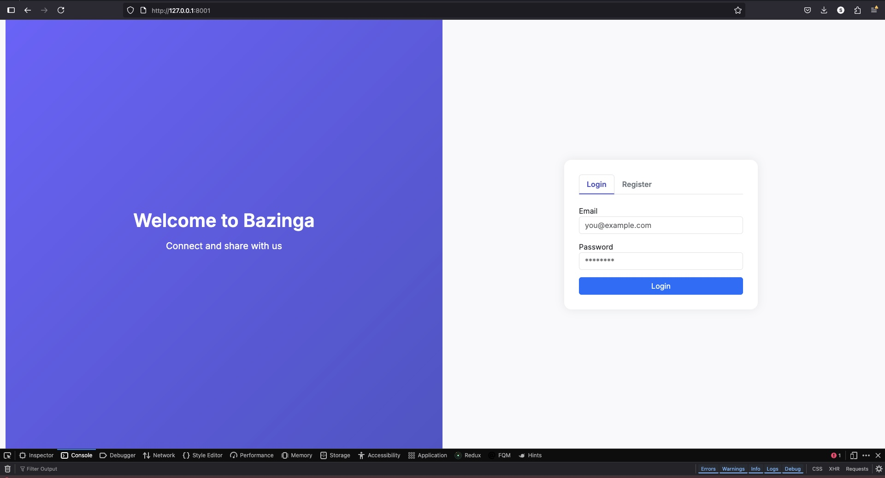

# 🌟 Laravel Blog app – Fullstack Laravel & Bootstrap Web App

Welcome to **Bazinga**, a fullstack web application built with the **Laravel framework** for the backend and a frontend experience powered by **Blade views**, **Bootstrap**, and **JavaScript**.

---

## 🚀 Features


- 🔐 **User Authentication**
  - Register and log in securely.
  - Session-based authentication using Laravel's built-in features.



- 🧠 **Login**
  - After login, users are redirected to their feed.
  - Content is dynamically fetched from the [DummyJSON API](https://dummyjson.com/) to enrich the experience.


- 📝 **Post**
  - Create new posts from your dashboard.
  - Edit existing posts or delete them with ease.
  - Only the logged-in user can manage their own content.


- 🗄️ **Data Storage**
  - All user accounts and posts are stored locally using **SQLite** for lightweight, fast access.

- 🎨 **Modern UI**
  - Fully responsive interface using **Bootstrap 5**.
  - Interactive components enhanced with vanilla JavaScript.

---

## 🧰 Tech Stack

| Layer       | Tech Used                            |
|-------------|--------------------------------------|
| Frontend    | Blade, Bootstrap 5, JavaScript       |
| Backend     | Laravel Framework (PHP 8+)           |
| API         | DummyJSON API                        |
| Database    | SQLite (Laravel Eloquent ORM)        |
| Auth        | Laravel Auth Scaffolding             |

---

## 🛠️ Installation

```bash
# Clone the repository
git clone https://github.com/stephen0111/laravel
cd laravel

# Install dependencies
composer install

# Set up your .env file
cp .env.example .env

# Generate app key
php artisan key:generate

# Run migrations (uses SQLite)
touch database/database.sqlite
php artisan migrate

# Start the development server
php artisan serve
